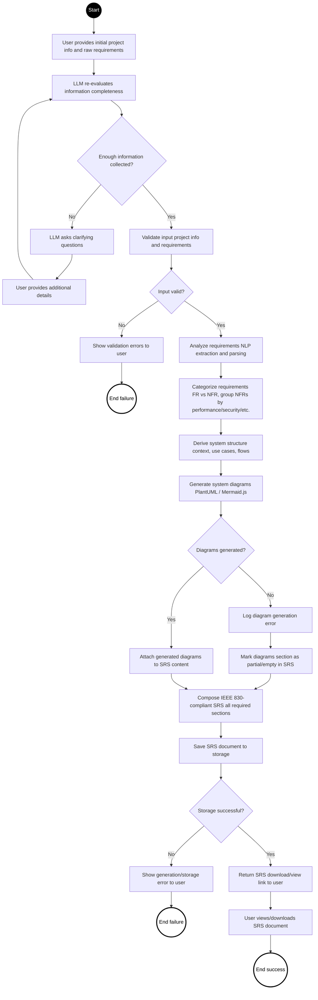

# Activity Diagram

Activity diagram of the Functional Requirement 4 (FR4) process.

```mermaid
flowchart TD
    %% FR-4: SRS Document Generation - Activity Diagram (LLM-driven trigger)

    A((Start)) --> B[User provides initial project info and raw requirements]

    B --> C[LLM evaluates information completeness]
    C --> D{Enough information collected?}

    D -- No --> E[LLM asks clarifying questions]
    E --> F[User provides additional details]
    F --> C[LLM re-evaluates information completeness]

    D -- Yes --> G[Validate input project info and requirements]
    G --> H{Input valid?}

    H -- No --> I[Show validation errors to user]
    I --> J((End failure))

    H -- Yes --> K[Analyze requirements NLP extraction and parsing]
    K --> L[Categorize requirements FR vs NFR, group NFRs by performance/security/etc.]

    L --> M[Derive system structure context, use cases, flows]
    M --> N[Generate system diagrams PlantUML / Mermaid.js]
    N --> O{Diagrams generated?}

    O -- No --> P[Log diagram generation error]
    P --> Q[Mark diagrams section as partial/empty in SRS]
    Q --> R[Compose IEEE 830-compliant SRS all required sections]

    O -- Yes --> S[Attach generated diagrams to SRS content]
    S --> R[Compose IEEE 830-compliant SRS all required sections]

    R --> T[Save SRS document to storage]
    T --> U{Storage successful?}

    U -- No --> V[Show generation/storage error to user]
    V --> W((End failure))

    U -- Yes --> X[Return SRS download/view link to user]
    X --> Y[User views/downloads SRS document]
    Y --> Z((End success))

    classDef startNode fill:#000,stroke:#000,stroke-width:0,color:#fff;
    classDef endNode fill:none,stroke:#000,stroke-width:3,color:#000;
    class A startNode;
    class J,Z,W endNode;
```