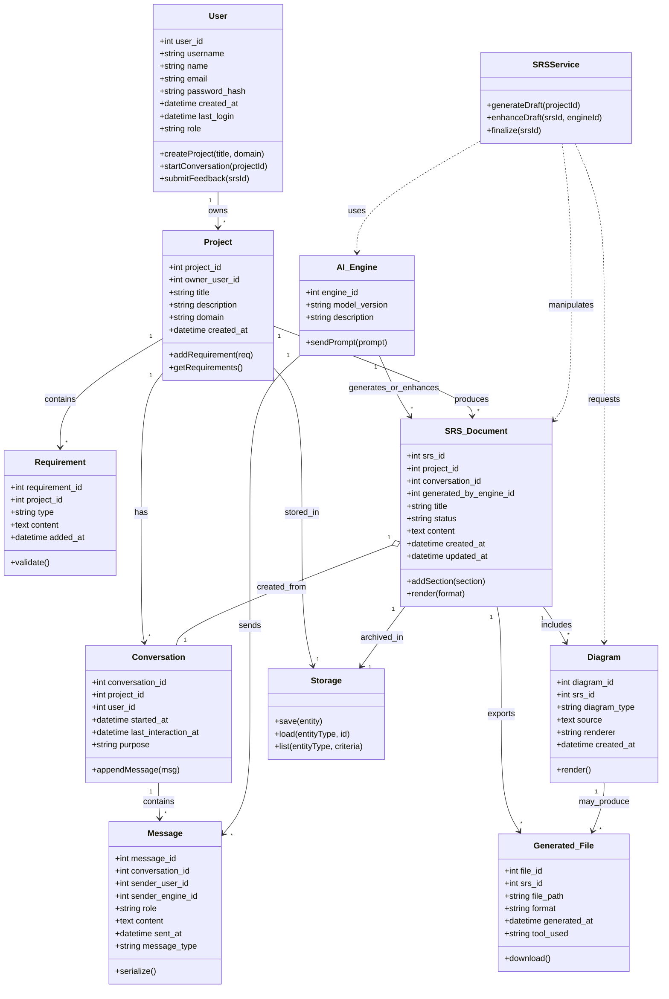

# Class Diagram

This diagram models the core domain classes for the Automated SRS Generator.

---

## Class details and interactions

Below are detailed descriptions of each class's attributes and methods, plus notes on how classes interact at runtime.

### User
- Attributes
	- user_id (int): Primary identifier for the user. Stable across sessions.
	- username (string): Unique short name used for login and display.
	- name (string): Full human-readable name.
	- email (string): Contact email; used for notifications and verification.
	- password_hash (string): Secure hash of the user's password; never store plain-text.
	- created_at (datetime): Account creation timestamp.
	- last_login (datetime): Timestamp of last successful authentication.
	- role (string): Role or permission level (e.g., admin, owner, collaborator, viewer).

- Methods
	- createProject(title, domain): Instantiates a `Project` with the calling user as owner, persists via `Storage.save`, and returns project metadata. Validates title and domain.
	- startConversation(projectId): Creates a `Conversation` linked to the specified `Project`. The conversation records the initiating user. Typically used to start SRS drafting or clarifying dialogs.
	- submitFeedback(srsId): Attaches user feedback to an `SRS_Document` (e.g., status change, comment). Internally this may create a `Message` or update a feedback field on the document.

### Project
- Attributes
	- project_id (int): Primary identifier.
	- owner_user_id (int): ID of the `User` who owns the project.
	- title (string): Project short title.
	- description (string): Longer summary of the project goals.
	- domain (string): Business or technical domain (used to seed AI prompts).
	- created_at (datetime): When the project was created.

- Methods
	- addRequirement(req): Creates and links a `Requirement` to this project. Performs basic validation and persists using `Storage.save`.
	- getRequirements(): Returns the list of `Requirement` objects for this project (via `Storage.list` or direct relation).

### Requirement
- Attributes
	- requirement_id (int): Primary identifier.
	- project_id (int): Back-reference to the owning Project.
	- type (string): Requirement type (e.g., functional, non-functional, constraint, business-rule).
	- content (text): The requirement text or structured payload.
	- added_at (datetime): When the requirement was added.

- Methods
	- validate(): Runs a set of syntactic/semantic validations (non-empty content, type constraints, cross-field checks). Returns validation result; may raise or return a detailed error object consumed by callers.

### Conversation
- Attributes
	- conversation_id (int): Primary identifier.
	- project_id (int): The project being discussed.
	- user_id (int): The user who started the conversation (initiator).
	- started_at (datetime): Timestamp conversation started.
	- last_interaction_at (datetime): Timestamp of most recent message.
	- purpose (string): Short description (e.g., 'generate initial draft', 'clarify requirements').

- Methods
	- appendMessage(msg): Appends a `Message` to the conversation, updates `last_interaction_at`, and persists via `Storage.save`. If the `Message` targets an AI engine, the conversation manager enqueues an AI request.

### Message
- Attributes
	- message_id (int): Primary identifier.
	- conversation_id (int): Which Conversation this belongs to.
	- sender_user_id (int): If a human user sent it, their user id.
	- sender_engine_id (int): If generated by an AI engine, the engine id (mutually exclusive with sender_user_id in many flows).
	- role (string): Role of sender in message context (e.g., 'user', 'assistant', 'system').
	- content (text): The message payload (prompt text, assistant result, annotations).
	- sent_at (datetime): Send/creation timestamp.
	- message_type (string): Semantic type (e.g., 'prompt', 'response', 'comment', 'feedback', 'command').

- Methods
	- serialize(): Returns a transport-friendly representation (JSON) for logging, storage, or sending to AI engines. May include metadata such as trace ids and provenance.

Notes on Message semantics and interactions:
- When a `User` sends a message (sender_user_id set, role='user'), `Conversation.appendMessage` persists it and—if needed—invokes `AI_Engine.sendPrompt` with a constructed prompt. The AI response is stored as a `Message` with sender_engine_id set and role='assistant'.

### SRS_Document
- Attributes
	- srs_id (int): Primary identifier.
	- project_id (int): Owning project.
	- conversation_id (int): The conversation that generated this document (if any).
	- generated_by_engine_id (int): AI engine used to create or enhance the draft.
	- title (string): Document title.
	- status (string): Draft/Review/Final/Archived.
	- content (text): Full textual content of the SRS (may be structured or markdown).
	- created_at (datetime): Creation time.
	- updated_at (datetime): Last updated time.

- Methods
	- addSection(section): Add or update a section (semantic block) in the document. May accept structured objects (id, heading, body). Persists the update and triggers re-render if needed.
	- render(format): Renders the SRS into a requested format (markdown, HTML, PDF). This method may call external tools to convert markdown → PDF and will create a `Generated_File` record for the output.

### Diagram
- Attributes
	- diagram_id (int): Primary identifier.
	- srs_id (int): The SRS document this diagram belongs to.
	- diagram_type (string): e.g., 'mermaid', 'uml', 'dfd', 'erd'.
	- source (text): Source definition (e.g., mermaid code or PlantUML text).
	- renderer (string): The rendering engine used (e.g., 'mermaid-cli', 'plantuml').
	- created_at (datetime): When the diagram was created.

- Methods
	- render(): Produces an image or vector file by invoking the configured `renderer`. On success it may create one or more `Generated_File` entries and link back to `SRS_Document`.

### Generated_File
- Attributes
	- file_id (int): Primary identifier.
	- srs_id (int): The SRS document that produced this file.
	- file_path (string): Filesystem or object-store path/URL to the artifact.
	- format (string): File format (PDF, PNG, SVG, DOCX, etc.).
	- generated_at (datetime): Timestamp of file generation.
	- tool_used (string): The tool or CLI used (e.g., 'pandoc', 'wkhtmltopdf', 'mermaid-cli').

- Methods
	- download(): Returns a signed URL or stream for downloading the artifact. For local deployments this may be a file read; for cloud object storage this returns a presigned URL.

### AI_Engine
- Attributes
	- engine_id (int): Primary identifier.
	- model_version (string): E.g., 'gpt-4.1', 'local-llm-1.0'.
	- description (string): Human readable notes about capabilities or configuration.

- Methods
	- sendPrompt(prompt): Sends a prompt to the AI provider, returns a `Message`-like response object. This method is responsible for batching/tracing, rate-limit handling, retries, and returning structured model output (text plus metadata like tokens/costs). It does not persist results itself; higher-level services (e.g., `SRSService` or `Conversation` manager) persist the `Message`.

Behavioral notes:
- `AI_Engine.sendPrompt` typically receives a prompt assembled from conversation messages, project context, and relevant requirements. The caller supplies context and a `conversation_id` so the response can be linked.

### Storage
- Methods
	- save(entity): Generic persistence entry point. Accepts entities like `User`, `Project`, `Message`, `SRS_Document`, and returns persisted object (with ids/timestamps filled).
	- load(entityType, id): Loads a single entity by type and id.
	- list(entityType, criteria): Query interface to list entities matching given criteria (e.g., all `Requirement` for project_id = X).

Responsibilities:
- `Storage` is the canonical persistence layer (DB or object store). Higher-level services should not depend on specific storage implementations; they use this interface.

### SRSService (controller / orchestration)
- Methods
	- generateDraft(projectId): Orchestrates drafting by gathering project data, requirements, and conversation context. It will create a `Conversation` (if none), assemble prompts, call `AI_Engine.sendPrompt`, store returned messages, create `SRS_Document` with initial content, and return the SRS id.
	- enhanceDraft(srsId, engineId): Sends additional prompts (requests for clarification, section expansion, or formatting) to the selected `AI_Engine`, merges enhancements into `SRS_Document`, and updates status.
	- finalize(srsId): Runs validations on the SRS (via `Requirement.validate()` where relevant), runs final rendering (calling `SRS_Document.render(format)`), and sets status to final/archived.

Service-level interactions and guarantees:
- `SRSService` owns orchestration but not low-level persistence. It uses `Storage` for saving/loading and `AI_Engine` for model calls. It writes `Message` and `SRS_Document` records so the system maintains a full provenance trail.

## Cross-class interaction examples (flows)

1. Create project
		- `User.createProject` -> creates `Project` -> `Storage.save(Project)`.

2. Start drafting SRS
		- `User.startConversation(projectId)` -> new `Conversation` persisted.
		- `Conversation.appendMessage` when user sends a prompt.
		- Backend constructs a consolidated prompt (project metadata + requirements + recent messages) and calls `AI_Engine.sendPrompt`.
		- AI response returned and saved as `Message` (sender_engine_id set).
		- `SRSService.generateDraft` collects AI responses and constructs `SRS_Document` (linked to conversation) and persists it.

3. Enhance / iterate
		- `SRSService.enhanceDraft` reads `SRS_Document`, sends targeted prompts to `AI_Engine` for improvements, updates content via `SRS_Document.addSection`, and updates the conversation with messages describing the change.

4. Produce exports
		- `SRS_Document.render(format)` triggers rendering; rendering produces `Generated_File` entries that reference the SRS and the tool used. If diagrams exist, `Diagram.render()` may be called as a sub-step and produce more `Generated_File` records.

5. Storage and provenance
		- All created objects (Message, SRS_Document, Generated_File, Diagram) are persisted via `Storage.save` and can be reloaded via `Storage.load` for audit, rollback, or re-rendering.

