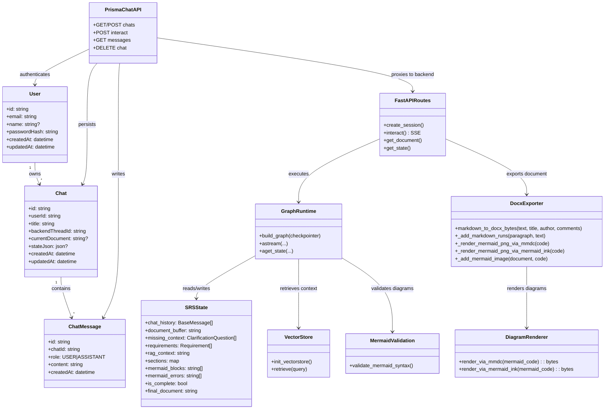

# Class Diagram

This diagram shows the main implemented models and core runtime components.

## Class Descriptions

- **User / Chat / ChatMessage** - Persisted Prisma models used by the Next.js app
- **SRSState** - Typed shared state passed through LangGraph nodes
- **GraphRuntime** - Compiled LangGraph workflow used by FastAPI endpoints
- **FastAPIRoutes** - Backend API for session lifecycle and SSE graph interaction, includes DOCX export endpoint
- **PrismaChatAPI** - Frontend API routes that authenticate users and bridge to backend
- **VectorStore** - Chroma-based retrieval over pre-seeded standards/compliance corpus
- **MermaidValidation** - Syntax validation step used in graph post-processing
- **DocxExporter** - Converts Markdown to DOCX with formatted text, embedded diagram images, and metadata
- **DiagramRenderer** - Renders Mermaid diagrams to PNG via mmdc or mermaid.ink HTTP API
