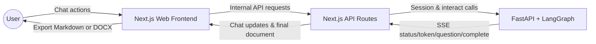
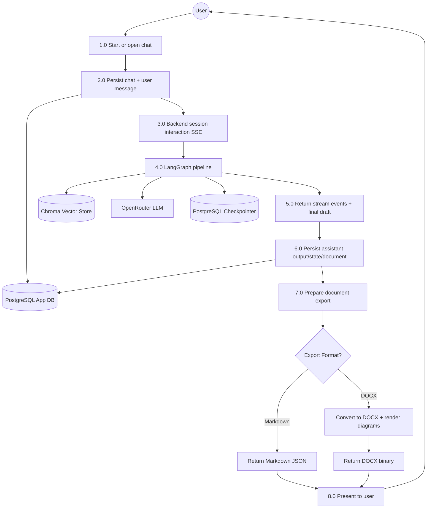
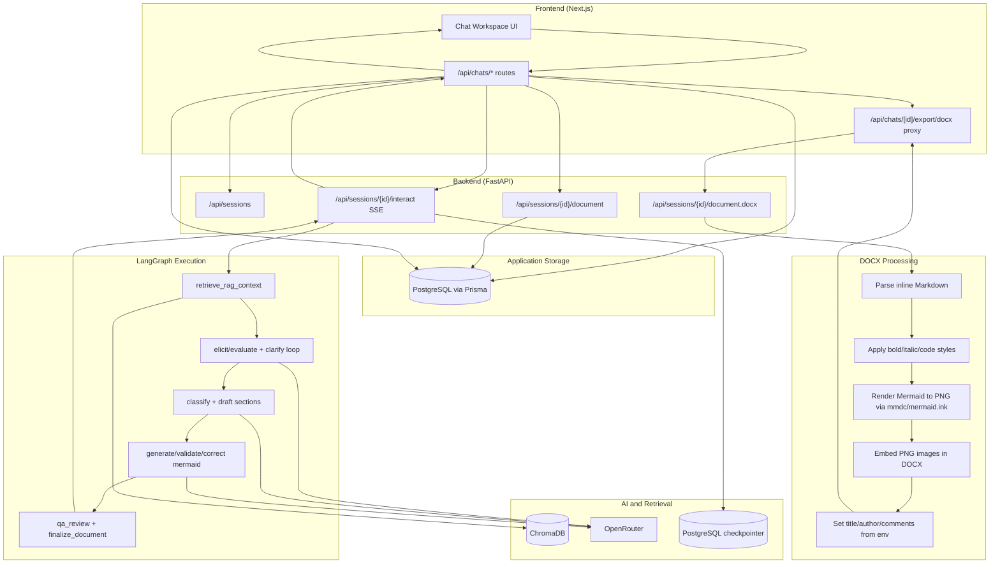

# Data Flow Diagrams

## DFD Level 0 - System Context

```mermaid
graph LR
    User((User)) -->|Chat actions| Frontend["Next.js Web Frontend"]
    Frontend -->|Internal API requests| Api["Next.js API Routes"]
    Api -->|Session & interact calls| Backend["FastAPI + LangGraph"]
    Backend -->|SSE status/token/question/complete| Api
    Api -->|Chat updates & final document| Frontend
    Frontend -->|Export Markdown or DOCX| User
```

## DFD Level 1 - Main Processes

```mermaid
graph TD
    User((User)) --> P1["1.0 Start or open chat"]
    P1 --> P2["2.0 Persist chat + user message"]
    P2 --> AppDB[(PostgreSQL App DB)]

    P2 --> P3["3.0 Backend session interaction SSE"]
    P3 --> Graph["4.0 LangGraph pipeline"]

    Graph --> VectorDB[(Chroma Vector Store)]
    Graph --> LLM[OpenRouter LLM]
    Graph --> Checkpointer[(PostgreSQL Checkpointer)]

    Graph --> P5["5.0 Return stream events + final draft"]
    P5 --> P6["6.0 Persist assistant output/state/document"]
    P6 --> AppDB
    
    P6 --> P7["7.0 Prepare document export"]
    P7 --> P8{Export Format?}
    P8 -->|Markdown| ReturnMarkdown["Return Markdown JSON"]
    P8 -->|DOCX| DocxConvert["Convert to DOCX + render diagrams"]
    DocxConvert --> ReturnDocx["Return DOCX binary"]
    ReturnMarkdown --> P9["8.0 Present to user"]
    ReturnDocx --> P9
    P9 --> User
```

## DFD Level 2 - Detailed Processing

```mermaid
graph TD
    subgraph Frontend["Frontend (Next.js)"]
        UI["Chat Workspace UI"]
        FEApi["/api/chats/* routes"]
        ExportProxy["/api/chats/[id]/export/docx proxy"]
    end

    subgraph AppStorage["Application Storage"]
        PrismaDB[(PostgreSQL via Prisma)]
    end

    subgraph Backend["Backend (FastAPI)"]
        Sessions["/api/sessions"]
        Interact["/api/sessions/{id}/interact SSE"]
        DocState["/api/sessions/{id}/document"]
        DocxExport["/api/sessions/{id}/document.docx"]
    end

    subgraph GraphExec["LangGraph Execution"]
        RAG["retrieve_rag_context"]
        Elicit["elicit/evaluate + clarify loop"]
        Draft["classify + draft sections"]
        Mermaid["generate/validate/correct mermaid"]
        QA["qa_review + finalize_document"]
    end

    subgraph DocxProc["DOCX Processing"]
        MarkdownParse["Parse inline Markdown"]
        BoldItalic["Apply bold/italic/code styles"]
        DiagramRender["Render Mermaid to PNG via mmdc/mermaid.ink"]
        EmbedImages["Embed PNG images in DOCX"]
        SetMetadata["Set title/author/comments from env"]
    end

    subgraph AIData["AI and Retrieval"]
        Chroma[(ChromaDB)]
        OpenRouter[OpenRouter]
        Checkpoint[(PostgreSQL checkpointer)]
    end

    UI --> FEApi
    FEApi --> PrismaDB
    FEApi --> Sessions
    FEApi --> Interact
    FEApi --> ExportProxy
    
    ExportProxy --> DocxExport

    Interact --> RAG --> Elicit --> Draft --> Mermaid --> QA
    RAG --> Chroma
    Elicit --> OpenRouter
    Draft --> OpenRouter
    Mermaid --> OpenRouter
    Interact --> Checkpoint

    QA --> Interact
    Interact --> FEApi
    FEApi --> DocState
    DocState --> PrismaDB
    
    DocxExport --> MarkdownParse
    MarkdownParse --> BoldItalic
    BoldItalic --> DiagramRender
    DiagramRender --> EmbedImages
    EmbedImages --> SetMetadata
    SetMetadata --> ExportProxy
    
    FEApi --> PrismaDB
    FEApi --> UI
```
