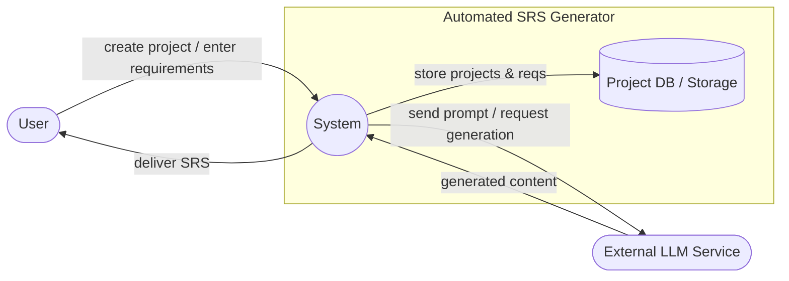
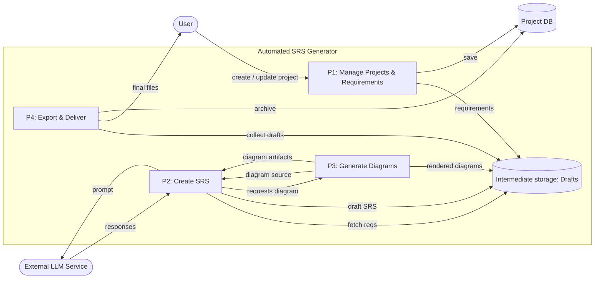
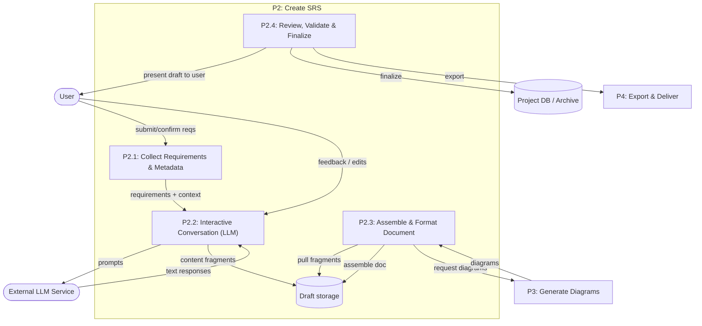

# Data Flow Diagrams (DFD)

- Context Diagram (Level 0)
- Level 1 - high-level functional decomposition
- Level 2 - detailed decomposition of the "Create SRS" process

---

## Context Diagram (Level 0)

---

## Level 1 - High-level processes

---

## Level 2 - Decompose P2: Create SRS (detailed)

