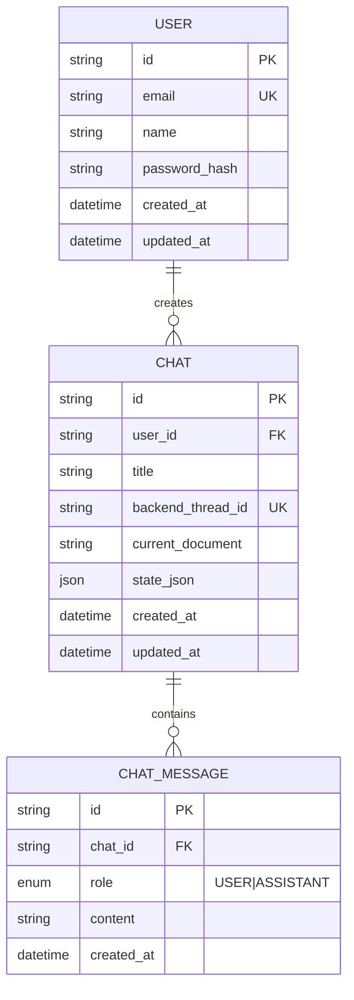

# Entity-Relationship Diagram

This diagram reflects the implemented Prisma schema used by the frontend app.

## Entity Descriptions

### USER
- Primary entity representing system users
- Stores authentication credentials and metadata
- One-to-many relationship with CHAT

### CHAT
- Represents a user conversation tied to a backend thread
- Links users to their conversations
- Contains multiple messages and stores latest generated document/state snapshot

### CHAT_MESSAGE
- Individual messages in a chat session
- Stores both user queries and system responses
- Includes role as enum (`USER` or `ASSISTANT`)
