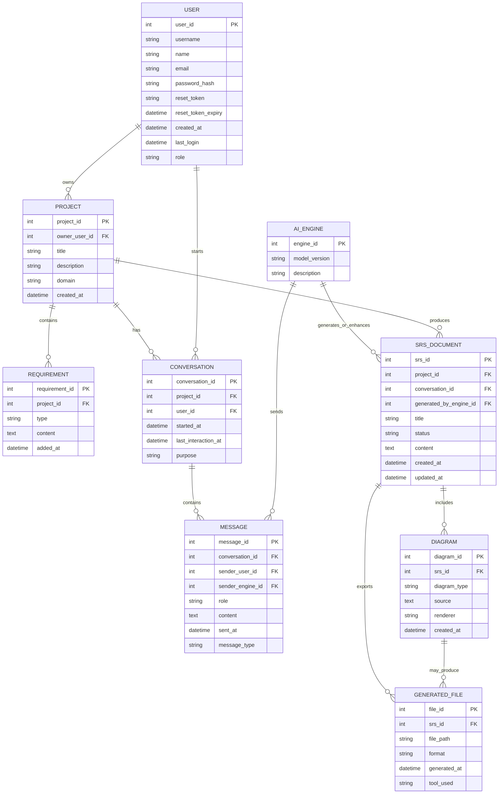

```mermaid
erDiagram

    %% Users & Auth
    USER {
        int user_id PK
        string username
        string name
        string email
        string password_hash
        string reset_token
        datetime reset_token_expiry
        datetime created_at
        datetime last_login
        string role
    }

    %% Projects and requirements
    PROJECT {
        int project_id PK
        int owner_user_id FK
        string title
        string description
        string domain
        datetime created_at
    }

    REQUIREMENT {
        int requirement_id PK
        int project_id FK
        string type
        text content
        datetime added_at
    }

    %% Conversations between user and LLM to build SRS pieces
    CONVERSATION {
        int conversation_id PK
        int project_id FK
        int user_id FK
        datetime started_at
        datetime last_interaction_at
        string purpose
    }

    MESSAGE {
        int message_id PK
        int conversation_id FK
        int sender_user_id FK
        int sender_engine_id FK
        string role
        text content
        datetime sent_at
        string message_type
    }

    %% SRS documents (versions/statuses: draft, enhanced, final)
    SRS_DOCUMENT {
        int srs_id PK
        int project_id FK
        int conversation_id FK
        int generated_by_engine_id FK
        string title
        string status
        text content
        datetime created_at
        datetime updated_at
    }

    DIAGRAM {
        int diagram_id PK
        int srs_id FK
        string diagram_type
        text source
        string renderer
        datetime created_at
    }

    %% Files exported from an SRS (docx, pdf, etc.)
    GENERATED_FILE {
        int file_id PK
        int srs_id FK
        string file_path
        string format
        datetime generated_at
        string tool_used
    }

    %% AI engines that generate/enhance content
    AI_ENGINE {
        int engine_id PK
        string model_version
        string description
    }


    %% Relationships
    USER ||--o{ PROJECT : "owns"
    PROJECT ||--o{ REQUIREMENT : "contains"
    PROJECT ||--o{ CONVERSATION : "has"
    USER ||--o{ CONVERSATION : "starts"
    CONVERSATION ||--o{ MESSAGE : "contains"
    AI_ENGINE ||--o{ MESSAGE : "sends"
    AI_ENGINE ||--o{ SRS_DOCUMENT : "generates_or_enhances"
    SRS_DOCUMENT ||--o{ DIAGRAM : "includes"
    SRS_DOCUMENT ||--o{ GENERATED_FILE : "exports"
    PROJECT ||--o{ SRS_DOCUMENT : "produces"
    DIAGRAM ||--o{ GENERATED_FILE : "may_produce"
```