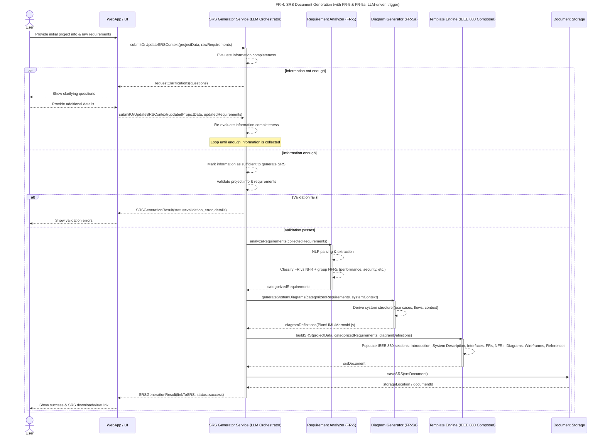

# Sequence Diagram

Sequence diagram of the Functional Requirement 4 (FR4) process.

```mermaid
sequenceDiagram
    title FR-4: SRS Document Generation (with FR-5 & FR-5a, LLM-driven trigger)

    actor User
    participant UI as WebApp / UI
    participant SRS as SRS Generator Service (LLM Orchestrator)
    participant Analyzer as Requirement Analyzer (FR-5)
    participant Diagrams as Diagram Generator (FR-5a)
    participant Template as Template Engine (IEEE 830 Composer)
    participant Storage as Document Storage

    %% User provides information iteratively
    User->>UI: Provide initial project info & raw requirements
    UI->>SRS: submitOrUpdateSRSContext(projectData, rawRequirements)
    activate SRS

    SRS-->>SRS: Evaluate information completeness
    alt Information not enough
        SRS-->>UI: requestClarifications(questions)
        UI-->>User: Show clarifying questions
        User-->>UI: Provide additional details
        UI-->>SRS: submitOrUpdateSRSContext(updatedProjectData, updatedRequirements)
        SRS-->>SRS: Re-evaluate information completeness
        note over SRS: Loop until enough information is collected
    else Information enough
        %% Once enough information is collected
        SRS-->>SRS: Mark information as sufficient to generate SRS

        %% Validate collected info
        SRS-->>SRS: Validate project info & requirements
        alt Validation fails
            SRS-->>UI: SRSGenerationResult(status=validation_error, details)
            UI-->>User: Show validation errors
        else Validation passes
            %% Extract & categorize requirements (FR-5)
            SRS->>Analyzer: analyzeRequirements(collectedRequirements)
            activate Analyzer
            Analyzer-->>Analyzer: NLP parsing & extraction
            Analyzer-->>Analyzer: Classify FR vs NFR + group NFRs (performance, security, etc.)
            Analyzer-->>SRS: categorizedRequirements
            deactivate Analyzer

            %% Generate diagrams (FR-5a)
            SRS->>Diagrams: generateSystemDiagrams(categorizedRequirements, systemContext)
            activate Diagrams
            Diagrams-->>Diagrams: Derive system structure (use cases, flows, context)
            Diagrams-->>SRS: diagramDefinitions(PlantUML/Mermaid.js)
            deactivate Diagrams

            %% Assemble IEEE 830-compliant SRS (FR-4)
            SRS->>Template: buildSRS(projectData, categorizedRequirements, diagramDefinitions)
            activate Template
            Template-->>Template: Populate IEEE 830 sections: Introduction, System Description, Interfaces, FRs, NFRs, Diagrams, Wireframes, References
            Template-->>SRS: srsDocument
            deactivate Template

            %% Store and deliver document
            SRS->>Storage: saveSRS(srsDocument)
            Storage-->>SRS: storageLocation / documentId

            SRS-->>UI: SRSGenerationResult(linkToSRS, status=success)
            deactivate SRS

            UI-->>User: Show success & SRS download/view link
        end
    end
```